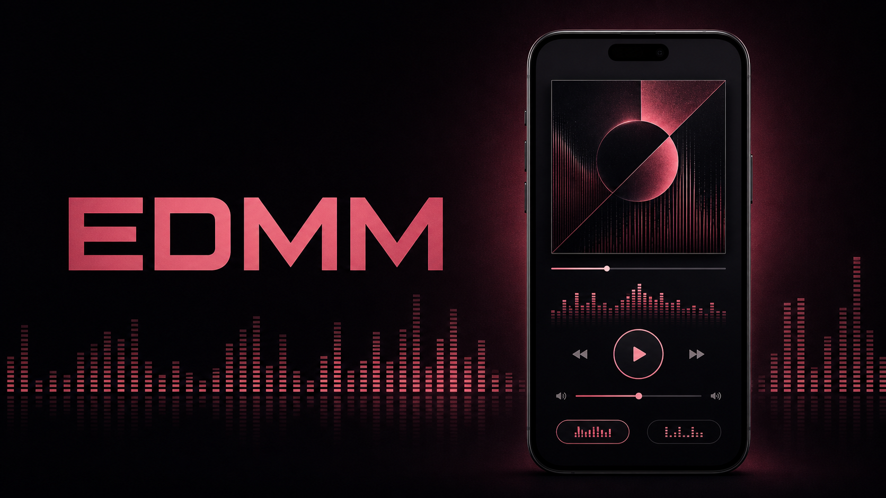

<p align="center">
  
</p>

<h1 align="center">EDMM</h1>

<p align="center">
  <strong>전자음악을 찾는 순간부터 듣는 순간까지, 하나의 흐름으로.</strong>
</p>

<p align="center">
  Pop과 EDM 카탈로그 탐색, 검색, 몰입형 오디오 재생을 연결한 Flutter 모바일 앱입니다.
</p>

<p align="center">
  <a href="https://github.com/HappyMarmot123/EDMM-flutter/actions/workflows/ci.yml"></a>
  
  
  
</p>


## 음악을 발견하고, 바로 재생하세요

EDMM은 카탈로그 탐색과 플레이어를 분리된 기능으로 다루지 않습니다. 원하는 트랙을 찾고, 상세 정보를 확인하고, 재생을 이어 가는 전 과정을 하나의 모바일 경험으로 구성했습니다.

`just_audio`, `audio_service` 기반 재생으로 백그라운드 오디오 플레이와 비주얼라이저, 이퀄라이저 프리셋을 제공합니다.

- [EDMM Android APK](https://drive.google.com/file/d/11P3CSfOMK0znpoCdmEu0vi4CDGtfr9FT/view?usp=sharing)

## 개발자 가이드

- Flutter `3.44.5` stable
- Dart SDK `^3.12.2`
- Android: JDK 17, Android SDK, 에뮬레이터 또는 USB 디버깅 기기
- iOS: macOS, Xcode, Simulator 또는 등록된 기기

### 로컬 실행

```bash
flutter pub get
flutter doctor
flutter devices
flutter run -d <device-id>
```